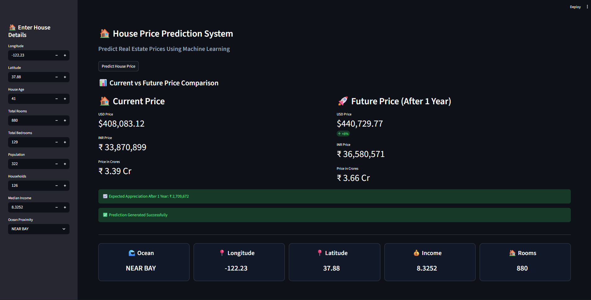

# 🏠 AI-Powered House Price Prediction & Future Value Forecasting

##  Project Overview

This project predicts house prices using Machine Learning and provides an interactive web dashboard built with Streamlit.

The system takes various house-related parameters as input and predicts:

* Current House Price (USD)
* Current House Price (INR)
* Current House Price (Crores)
* Future Estimated Price (After 1 Year)
* Expected Property Appreciation

The project uses a Linear Regression model trained on housing data and includes a complete data preprocessing pipeline.


## Features

* Interactive Streamlit Dashboard
* Machine Learning-Based House Price Prediction
* Future Property Value Forecasting
* Currency Conversion (USD → INR → Crores)
* Data Preprocessing Pipeline
* User-Friendly Interface
* Real-Time Prediction

---

##  Machine Learning Workflow

### 1. Data Collection

The project uses the Housing Dataset (`housing.csv`).

### 2. Data Preprocessing

The following preprocessing techniques are applied:

* Missing Value Handling using Median Imputation
* Feature Scaling using StandardScaler
* Categorical Encoding using OneHotEncoder
* Numerical and Categorical Pipelines using ColumnTransformer

### 3. Model Training

Algorithm Used:

* Linear Regression

The model is trained on 80% of the dataset and evaluated using cross-validation.

---

## 📊 Input Parameters

The user provides the following house details:

| Parameter       | Description              |
| --------------- | ------------------------ |
| Longitude       | Geographic Longitude     |
| Latitude        | Geographic Latitude      |
| House Age       | Age of Property          |
| Total Rooms     | Total Number of Rooms    |
| Total Bedrooms  | Total Number of Bedrooms |
| Population      | Population in Area       |
| Households      | Number of Households     |
| Median Income   | Median Income of Area    |
| Ocean Proximity | Location Category        |

---

## Output Generated

The system predicts:

### Current Property Value

* Price in USD
* Price in INR
* Price in Crores

### Future Forecast

* Predicted Price After 1 Year
* Future Value in INR
* Future Value in Crores
* Expected Appreciation Amount

---

##  Technologies Used

### Programming Language

* Python

### Libraries

* Pandas
* NumPy
* Scikit-Learn
* Streamlit

### Machine Learning

* Linear Regression
* Data Preprocessing Pipeline

---

##  Project Structure

```text
house-price-prediction-system
│
├── app.py
├── main.py
├── housing.csv
├── requirements.txt
├── README.md
├── project_screenshot.png
└── .gitignore
```

---


## 📸 Dashboard Preview



---

## Future Enhancements

* Random Forest Regressor
* XGBoost Model
* Real-Time Property Data Integration
* Interactive Graphs and Charts
* Property Recommendation System
* Multi-City Price Prediction

---

## Learning Outcomes

Through this project, the following concepts were implemented:

* Data Preprocessing
* Feature Engineering
* Machine Learning Model Training
* Model Evaluation
* Streamlit Dashboard Development
* Python Programming
* GitHub Project Management

---

##  Author

Pranav Gundap

Machine Learning | Data Science | Python Development
